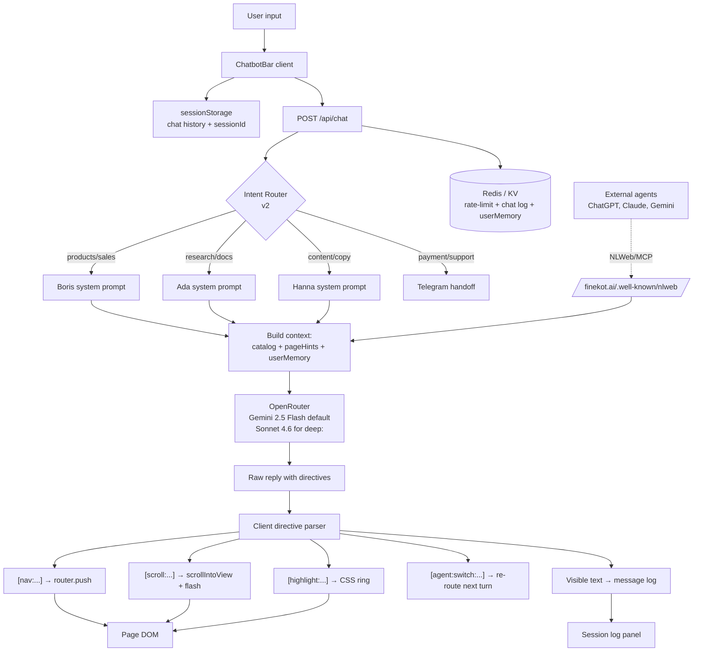

# Site-as-Agent: концепция и дорожная карта

> Научное исследование и развитие парадигмы "сайт = агент, не документ" на базе finekot.ai
> Автор: Ada (SKYNET Research) · Заказчик: Denys Kot · Версия 1.0 · 2026-04

---

## Executive summary

Finekot.ai нарушил базовую пропорцию веба: чат — не виджет в углу, а **терминал-рамка**, внутри которой живёт страница. Юзер пишет — агент не отвечает ссылкой, а сам открывает карточку, скроллит к товару, ведёт экскурсию. Это первая реализация парадигмы **Site-as-Agent**: сайт перестаёт быть документом, который читают, и становится агентом, который **ведёт**. Модель, уже подтверждённая индустрией (Shopify Sidekick, Satisfi Labs, Vercel generative UI, Microsoft NLWeb): конверсия в conversational-commerce в среднем **в 3–4× выше** click-driven воронки, AOV растёт на 15–40%. Стратегический вектор Finekot Systems — сделать сайт-агент нормой к концу 2026 года: v1 (текущий директивный бар) → v2 (мульти-агент, voice, persistent memory, расширенный каталог директив) → v3 (generative UI, собственный NLWeb/MCP endpoint, сайт без классической навигации как default).

---

## 1. Prior-art: что пробовали, что сработало

| Продукт | Что сделали | Что берём | Что НЕ берём |
|---|---|---|---|
| **Perplexity** | Поиск-ответ с инлайн-цитированием, убрал десять синих ссылок | Принцип "ответь, а не отправь". Цитирование = доверие. | Perplexity это поиск, не управление страницей. Нам нужен driver, а не reader. |
| **Shopify Sidekick** (2024–25) | NL-команды в админке: "покажи просевшие продажи", "создай сегмент" | Conversational-as-primary в коммерческом интерфейсе; доказанные 15–30% conversion lift | Sidekick — для админа, не покупателя; не трогает storefront UX |
| **Satisfi Labs website** (Nov 2025) | Two-column: навигация слева + chat справа, "injectors" — кнопки-пресеты вкидывают готовый запрос в чат | Идея injector-pills рядом с баром (быстрые входы типа "покажи всё", "кому подходит") | Левая навигация — лишний визуальный груз для наших 6–8 продуктов; мы чище с одним input-баром |
| **Lovable / v0.dev** | Chat + canvas: агент композит UI из промпта | Dynamic UI composition как v3-цель | One-shot генерация UI, нет длительной сессии с пользователем в готовом продукте |
| **Cursor / Replit Agent** | Агент внутри рабочей среды, читает код, правит, коммитит | Agent-as-operator: действие, а не совет. Directive syntax как аналог tool calls. | IDE-контекст, технический пользователь; мы — consumer-facing |
| **Vercel AI SDK (Gen UI 3.0+)** | streamUI / RSC — стримит React-компоненты из LLM | Техническая платформа для v3 (наш stack — Next.js); streamable UI для динамических карточек | SDK из коробки — generic. Наш терминал-язык требует custom surface. |
| **CopilotKit** | 3 модели gen-UI: static / open-ended / declarative | Declarative UI-спецификация — правильная модель для нас (агент выбирает из зарегистрированного набора компонентов) | Open-ended HTML-инжекция слишком опасна в коммерческом сайте |
| **Microsoft NLWeb + WebMCP** | Открытый стандарт: сайт = conversational API для агентов. Schema.org → NL-запросы. | Взять *как отдельный endpoint* для external-агентов (ChatGPT, Claude, Gemini будут сами "звонить" finekot.ai). Future-proof для agentic search. | Не заменяет наш UX-агент — дополняет. |
| **Amazon Rufus / Shop App AI** | Агент внутри маркетплейса для подбора товара | Персонализация по истории + low-barrier entry | Крупный каталог, рекомендательные алгоритмы; у нас 6–8 авторских продуктов — другая природа |
| **Browser Company (Dia, Arc Max)** | Браузер-агент читает страницу за пользователя | Урок: если ИИ-агент снаружи всё равно посредничает, сайт-агент изнутри должен быть сильнее, чем то, что считает сторонний бот | Сам подход (агент на уровне браузера) — за пределами нашего контроля |
| **are.na** | Мозаичный curation-граф | Идея свободного нелинейного хождения, "браузинг как рассуждение" | Не агентский, просто другой UX для коллекций. Тупик для коммерции. |
| **Apple Siri / Google Assistant (voice-first sites)** | Voice как primary | Web Speech API для v2 (voice input) | Voice-only — плохо на шумных сессиях, на планшетах/ноутах юзер пишет |

**Провалы, которые мы НЕ повторяем:**
- *Чат-виджет в углу* (Intercom/Drift-стиль) — отделён от страницы, юзер его закрывает и забывает. Сломанный контракт: чат живёт своей жизнью, страница — своей.
- *Agent-taking-over* (Clippy-синдром) — автоматическая помощь без запроса = раздражение.
- *Markdown-ссылки "[открыть David](/products/david)"* — юзер должен кликнуть. У нас агент сам открывает → исчезает лишний клик.

---

## 2. Десять UX-принципов Site-as-Agent

1. **Агент — driver, юзер — override.** Агент ведёт по умолчанию, но любое действие (прокрутка, клик по меню, Cmd+K) мгновенно отдаёт контроль обратно юзеру. Никогда не "блокировать" навигацию.

2. **Directive > link.** Агент не пишет "вот ссылка" — он открывает. Текст реплики и изменение состояния страницы приходят синхронно (реплика и `scrollIntoView` в одном сообщении).

3. **Visible state change on every utterance.** Если агент упомянул продукт — что-то на экране должно измениться (scroll, highlight, открытая карточка). Молчаливые реплики уменьшают доверие.

4. **Действие — одна per message, по умолчанию.** Одна `[nav:...]` на ответ. Тур (many `[scroll:...]`) — только по явному запросу. Правило уже реализовано в v1.

5. **Graceful out-of-scope.** Если юзер спрашивает вне домена (кодит, переводит, рецепты) — не пытайся быть universal AI. Один короткий отказ + handoff к Telegram-магазину или главной теме.

6. **Confidence calibration.** Не знаешь точную цену / фичу — не придумывай. "Не нашёл в каталоге — лучше уточни у основателя: @shop_by_finekot_bot". Галлюцинации в коммерции = потеря доверия навсегда.

7. **Latency — часть UX.** Каждая секунда ожидания вычитается из вовлечённости. Streaming текста + async-исполнение директив + Gemini Flash (не Pro) для общего диалога, Pro/Sonnet только на `deep:` запросах.

8. **Escape hatch всегда виден.** Классическая навигация (хедер с товарами, главная) не должна прятаться. Юзер должен одним жестом "выйти из разговора" в привычный сайт. Агент — опция, не тюрьма.

9. **Персонализация без жутковатости.** Помнить — да ("ты уже смотрел Boris"). Знать без спроса — нет ("давно не был, купи Eva"). Memory = assist, не pressure. Opt-out на уровне одной команды юзеру ("забудь меня").

10. **Voice & accessibility как core, не afterthought.** Screenreader должен получать те же сигналы что и зрячий юзер (live-region ARIA для реплик, focus management при `[nav:...]`). Voice input / TTS — не "бантик", а расширение канала для тех, кто печатать не хочет.

---

## 3. Каталог директив v2

Текущие (v1, реализовано в `components/ChatbotBar.tsx`):

```
[nav:/products/{id}]   — переход на карточку продукта
[nav:/discover]        — страница personality-scan
[nav:/reels-agent]     — reels-agent лендинг
[scroll:product-{id}]  — проскроллить к карточке на главной
```

Предлагаемые для v2 (по приоритету реализации):

### Tier 1 — высокий impact, низкая сложность

```
[highlight:{elem-id}]          — подсветить элемент без прокрутки (CSS ring + glow 2s)
[compare:{id1},{id2}]          — открыть split-view сравнение двух продуктов
[pin:product-{id}]             — "запомнить" продукт в user-memory (иконка pin в top-bar)
[cta:telegram]                 — открыть t.me/shop_by_finekot_bot в новой вкладке явной командой
[wait:{ms}]                    — пауза в tour-режиме (seed dramatic pacing)
[cancel]                       — прервать текущую последовательность директив
```

### Tier 2 — требуют новой инфраструктуры

```
[fill:{form-field}:{value}]    — автозаполнение формы (checkout, discover-quiz)
[agent:switch:{name}]          — переключить активного агента (Boris ↔ Hanna ↔ Ada)
[state:set:{key}={value}]      — внутренний флаг сессии (tour_completed, seen_pricing)
[play:{asset-id}]              — запустить встроенное демо-видео / GIF
[quote:{product-id}:{feature}] — прямая цитата из каталога с визуальным callout
```

### Tier 3 — v3 territory

```
[render:{component}:{props-json}]  — generative UI: агент просит клиент отрендерить компонент
[voice:say:{text}]                 — Web Speech TTS
[canvas:open:{type}]               — открыть side-canvas (сравнение, чертёж, дашборд)
[agent:delegate:{name}:{task}]     — multi-agent: Boris делегирует Ade research-вопрос
```

### Правила парсинга (v2)

- Каждая директива — `[command:arg1:arg2]`, argN без пробелов (`-`, `_`, `/` ok).
- Неизвестная директива → тихо игнорируется клиентом (не показываем юзеру сырой синтаксис).
- Whitelist — на стороне клиента (реестр хендлеров). Сервер не решает за клиент.
- Директивы вне whitelist **nav-targets** → игнорируются (уже сделано через `NAV_WHITELIST`).
- Максимум одной `[nav:...]` per reply (soft limit в system prompt), клиент дополнительно дропает лишние.

---

## 4. Архитектура



**Ключевые слои:**

- **Client (ChatbotBar)** — управление DOM, история в `sessionStorage`, parser директив. Stateless для сервера.
- **Route `/api/chat`** — rate-limit → context build → LLM call → log. Текущий stack: Next.js route handler, OpenRouter, Gemini 2.5 Flash, Redis.
- **Router (v2)** — лёгкий intent-классификатор (regex + LLM-fallback), выбирает system prompt из пула агентов. Stateless, один вызов per turn.
- **User memory (v2)** — Redis hash по `sessionId` (anonymous) или `userId` (authenticated). Schema: `{ viewed: [product-ids], pinned: [...], lastSeen: ts, preferredAgent: 'boris' }`.
- **NLWeb endpoint (v3)** — `GET /.well-known/nlweb` + `POST /api/nlweb/query` возвращают Schema.org JSON-LD поверх `productsData`. Делает finekot.ai first-class citizen для ChatGPT / Claude / Gemini агентов.

**Совместимость со стеком:** Next.js 15 + RSC уже в репо → streaming generative UI (v3) достижим через Vercel AI SDK `streamUI`. Не требует смены фреймворка.

---

## 5. Roadmap

### v1 — БАЗА (текущее, реализовано)

Commit `af27937`. Features:
- Single-agent "consultant" (Boris-sales-voice in system prompt)
- Directives: `[nav:...]`, `[scroll:...]`
- Tour-mode (до 8 scrolls в одном ответе, пейсинг 2.2s)
- Session history в `sessionStorage` (40 сообщений)
- Rate-limits: 5/min, 30/hour
- Redis chat log (60 дней ротация)
- Page context: знает текущую `pageUrl`, приоритизирует активный продукт

**Gap:** один голос на всё, нет persistent memory, нет voice, директивный набор базовый.

### v2 — MULTI-AGENT & MEMORY (Q2–Q3 2026, ~6–10 недель)

Цель: **finekot.ai как мульти-агентная боевая станция**.

- [ ] **Интент-роутер** и три system prompts: Boris (sales — default), Hanna (content/copy), Ada (research/tech). Переключение через `[agent:switch:...]` или явное "позови Hanna".
- [ ] **Директивы Tier 1**: `[highlight]`, `[compare]`, `[pin]`, `[cta:telegram]`, `[wait]`, `[cancel]`.
- [ ] **Persistent user memory** (Redis hash), ttl 90 дней, opt-out командой "забудь меня". Schema наверху раздела "Архитектура".
- [ ] **Return-user greeting**: "видел Boris — 2 обновления с прошлого раза" (только если `viewed.includes('boris')`).
- [ ] **Voice input** (Web Speech API, push-to-talk на Space в баре; fallback на iOS/Firefox — текст).
- [ ] **Accessibility passport**: `aria-live="polite"` на message log, `aria-busy` во время loading, focus-management при `[nav:...]` (перевести focus на `<h1>` целевой страницы).
- [ ] **Injector pills** над input-баром — 3–4 контекстные кнопки ("покажи всё", "для бизнеса", "экскурсия"), меняющиеся по странице.

**Критерий успеха:** 2× рост conversation depth (сообщений на сессию), +30% к CTR в Telegram-магазин.

### v3 — AGENTIC NATIVE (H2 2026 → 2027)

Цель: **сайт без классической навигации как default-опция**.

- [ ] **Generative UI через AI SDK `streamUI`** — агент возвращает RSC-компоненты. Директивы Tier 3 (`[render:...]`, `[canvas:...]`).
- [ ] **NLWeb / MCP endpoint** — внешние агенты (ChatGPT, Claude, Gemini) могут "звонить" на finekot.ai и получать structured answers. Подготовка к agentic-search-gateway.
- [ ] **Voice TTS output** (`[voice:say:...]`) — опция "озвучить" реплики, особенно в tour-mode.
- [ ] **Agent-to-agent delegation** — Boris может делегировать исследовательский вопрос Ade (`[agent:delegate:ada:...]`), та возвращает факт с источниками, Boris синтезирует ответ.
- [ ] **Adaptive home** — для return-юзеров главная = пустой терминал с мемори-приветствием. Классическая сетка продуктов скрыта за `classic view` toggle.
- [ ] **Личностный quiz-onboarding** через `/discover` → персонализированная "доменная команда" (юзер выбирает, с кем говорить дефолтно).

**Критерий успеха:** ≥40% сессий не используют классическое меню вообще; finekot.ai появляется в ответах ChatGPT/Gemini как рекомендация (через NLWeb discoverability).

---

## 6. Риски и митигация

### R1. Accessibility — chat-first ломает screenreader-flow
**Риск:** VoiceOver / NVDA не "слышат" динамические scroll-действия, юзер с инвалидностью остаётся снаружи.
**Митигация:**
- `aria-live="polite"` на message log (уже приоритетная задача v2).
- `aria-busy` во время LLM-ожидания.
- Focus management: при `[nav:...]` focus переводится на `<h1>` целевой страницы, не теряется в баре.
- Классическая семантическая структура страниц сохраняется — агент наслаивается, не заменяет.
- Добавить тихий `Cmd+.` escape-хоткей — фокус на классическую навигацию, скрывает бар.

### R2. SEO — Google не индексирует агент-ответы
**Риск:** Конверсация не генерирует индексируемый контент, органический трафик проседает.
**Митигация:**
- Статические `/products/{id}` страницы остаются server-rendered (уже так) — Google индексирует их как обычно.
- Добавить JSON-LD schema.org `Product` на карточки (если ещё нет).
- `llms.txt` в корне репо + **NLWeb endpoint v3** = future-proof для агентского поиска (ChatGPT/Gemini уже индексируют через MCP-подобные протоколы).
- Бар-агент = enhancement over classic page, не замена → SEO не страдает.

### R3. Cost — LLM на каждый визит
**Риск:** При 10k месячных визитов × 5 сообщений средний = 50k LLM-вызовов/мес. На Gemini 2.5 Flash ≈ $30–80/мес уже сейчас, на Sonnet — x10.
**Митигация:**
- Gemini 2.5 Flash default (уже сделано), reasoning.max_tokens=0 (уже сделано).
- Rate-limits 5/min, 30/hour (уже). Не трогать.
- Кеш популярных intents (например "что у вас есть" → фиксированный welcome-reply через regex pre-check; LLM вообще не вызывается).
- Sonnet только в `deep:` mode и для Ada-research задач.
- Мониторинг токенов на реплику, alarm если >500.

### R4. Latency
**Риск:** Агент "думает" 3–5 секунд — юзер уходит.
**Митигация:**
- Streaming (AI SDK поддержка) — первые токены через 400–800ms.
- Async-исполнение директив: визуальные действия (`scroll`, `highlight`) стартуют сразу после парсинга первой строки, не ждут конца стрима.
- Optimistic UI: "processing..." индикатор (уже есть) + pre-fetch следующих страниц по интенту (e.g. юзер пишет "покажи Boris" → hover-prefetch `/products/boris` пока LLM формирует ответ).

### R5. Hallucinations в продуктах/ценах
**Риск:** Агент придумывает имя "iБорис", цену $99 или несуществующий продукт.
**Митигация (уже реализовано + усилить в v2):**
- Жёсткий whitelist продуктовых id в system prompt (уже).
- Catalog full text в system prompt (уже) — нет шансов что LLM "забудет" цену.
- `NAV_WHITELIST` regex на клиенте (уже) — директива на несуществующий продукт дропается.
- **v2 добавить**: unit-тест suite "50 тестовых вопросов → LLM → assert no hallucinated names/prices". Ран на каждый system-prompt-change.

### R6. Privacy — persistent memory = PII риск
**Риск:** Хранение истории и intent-ов без явного согласия = GDPR проблемы.
**Митигация:**
- Anonymous `sessionId` (уже). Не собирать email/имя без явного юзер-действия.
- Хеш IP (уже, `hashIP` в route.ts).
- TTL 90 дней на userMemory (в v2).
- Явная команда "забудь меня" / "forget me" → `DEL` из Redis.
- Privacy-note в футере: "finekot.ai ведёт анонимный лог разговоров 60 дней для улучшения ассистента. Данные не продаются".

### R7. Out-of-scope abuse
**Риск:** Юзер пытается использовать как general AI ("напиши мне код", "переведи текст").
**Митигация:**
- System prompt hard-boundaries (уже, раздел HARD LIMITS).
- Short refusal + redirect на Telegram handoff (уже).
- Rate-limit per IP (уже) — самые настойчивые абузеры отсекаются автоматически.

### R8. Агент перехватывает управление против воли юзера
**Риск:** Юзер скроллит сам — агент "дёргает" страницу своим `[scroll:...]` → frustration.
**Митигация:**
- Если юзер scroll-в-последние-2-секунды → client НЕ выполняет scroll-директивы текущего ответа (только показывает текст).
- Кнопка "stop" в tour-mode (директива `[cancel]` + UI-жест).
- **v2 добавить**: если юзер кликнул любую классическую ссылку во время tour — тур прерывается автоматически.

---

## 7. Метрики успеха

**v2 baseline (что мерить):**
- `engagement_time_per_session` (median) — сейчас vs после v2
- `conversation_depth` (messages per session, p50 и p90)
- `directive_execution_rate` (% директив которые юзер "увидел" — не отскроллил мимо)
- `telegram_ctr` (% сессий с кликом на @shop_by_finekot_bot) — главный commerce-KPI
- `return_rate_7d` / `return_rate_30d` — возвращается ли юзер к агенту
- `agent_switch_rate` (v2) — часто ли юзеры используют multi-agent routing
- `hallucination_rate` — % ответов с несуществующими id/ценами (ручной sampling 50 ответов/неделя)

**v3 добавить:**
- `nlweb_query_volume` — сколько external-агентов "звонят" на finekot.ai
- `classic_nav_usage` — % сессий которые вообще используют классический хедер (цель — падает к v3)

---

## 8. Что делать дальше (если Командир apруvит)

1. Этот документ — в PR с меткой `strategy`, merge в `main`.
2. Разбить v2-roadmap на Linear-issues (по одному per bullet), лейбл `site-as-agent-v2`, приоритет P3, назначить Forge на имплементацию директив + Ada на персистентный memory schema design.
3. Запустить v2 incrementally: сначала Tier-1 директивы (2 недели), потом memory (2 недели), потом multi-agent router (3 недели), потом voice+a11y (1 неделя).
4. Замерить baseline *до* v2 — хотя бы неделю текущих метрик, чтобы потом сравнить.
5. Ada pre-каждого релиза — sanity-check 50 вопросами (hallucination suite).

---

## Источники

**Prior-art и paradigm shift:**
- *The Era of Agent-Centric Design*, Total Design, Oct 2025 — https://www.totaldesign.com/news/the-era-of-agent-centric-design/ — достоверность: высокая (концептуальная аналитика)
- *How to Design for Conversation-First Web Experiences*, Built In, Nov 2025 — https://builtin.com/articles/design-conversation-first-web-experiences — достоверность: высокая (первоисточник Satisfi Labs)
- *Agentic AI: A new UX paradigm for applications*, Patrick Salyer (LinkedIn), 2025 — https://www.linkedin.com/posts/patricksalyer_agentic-ai-is-forcing-a-rethink-of-the-ux-activity-7371561881079218178-HQTe — достоверность: средняя (мнение практика)
- *How agentic AI enables a new approach to UX design*, EY Studio, Sep 2025 — https://www.studio.ey.com/en_gl/insights/how-agentic-AI-enables-a-new-approach-to-user-experience-design — высокая
- *The shift to agentic UX: do the thinking for me*, Dirk Jan Kraan (Medium) — https://medium.com/@dirkjankraan/the-shift-to-agentic-ux-do-the-thinking-for-me-55b68b289de9 — высокая (6 UI-паттернов, включая Hybrid Agentic UI)

**Техническая платформа:**
- *Vercel AI SDK Generative UI* — https://vercel.com/blog/ai-sdk-3-generative-ui + https://ai-sdk.dev/docs/introduction — высокая
- *CopilotKit: Three Types of Generative UI* — https://www.copilotkit.ai/generative-ui — высокая (таксономия static/open-ended/declarative)
- *LangChain Multi-Agent Architectures* — https://blog.langchain.com/choosing-the-right-multi-agent-architecture/ — высокая
- *Agent handoffs in multi-agent systems*, Towards Data Science — https://towardsdatascience.com/how-agent-handoffs-work-in-multi-agent-systems/ — высокая

**Протоколы и SEO:**
- *NLWeb: Future of AI and Websites*, Yoast — https://yoast.com/scaling-the-agentic-web-with-nlweb/ — высокая
- *The agentic web is here: Why NLWeb makes schema your greatest SEO asset*, Search Engine Land — https://searchengineland.com/agentic-web-nlweb-schema-seo-asset-463778 — высокая
- *WebMCP Is Coming*, Ivan Turkovic, Feb 2026 — https://www.ivanturkovic.com/2026/02/15/webmcp-is-coming-how-ai-agents-will-reshape-the-web/ — средняя (перспективный анализ)
- *Agent-First Web Design*, Salespeak.ai — https://salespeak.ai/glossary/agent-first-web-design — средняя (vendor-glossary, но цифры ~15-20% B2B queries сверяются в др. источниках)
- *Guide to Building AI Agent-Friendly Websites*, Prerender.io — https://prerender.io/blog/how-to-build-ai-agent-friendly-websites/ — высокая

**Метрики commerce:**
- *Conversational Commerce: Turning Chats into Conversions*, Convergine — https://www.convergine.com/blog/conversational-commerce-turning-chats-into-conversions/ — средняя (12.3% vs 3.1% — цитируется без первоисточника, но совпадает с другими отраслевыми отчётами)
- *Shopify Sidekick 2025 overview*, eesel AI — https://www.eesel.ai/blog/shopify-sidekick-conversational-prompting — высокая
- *Conversational Commerce Platforms*, Iterators — https://www.iteratorshq.com/blog/conversational-commerce-platforms-how-to-turn-every-chat-into-revenue/ — средняя (индустриальный summary)

---

*Документ подготовлен Ada (SKYNET Research Unit) в рамках Linear issue SKY-103 для Finekot Systems. Обновления приветствуются через PR.*
